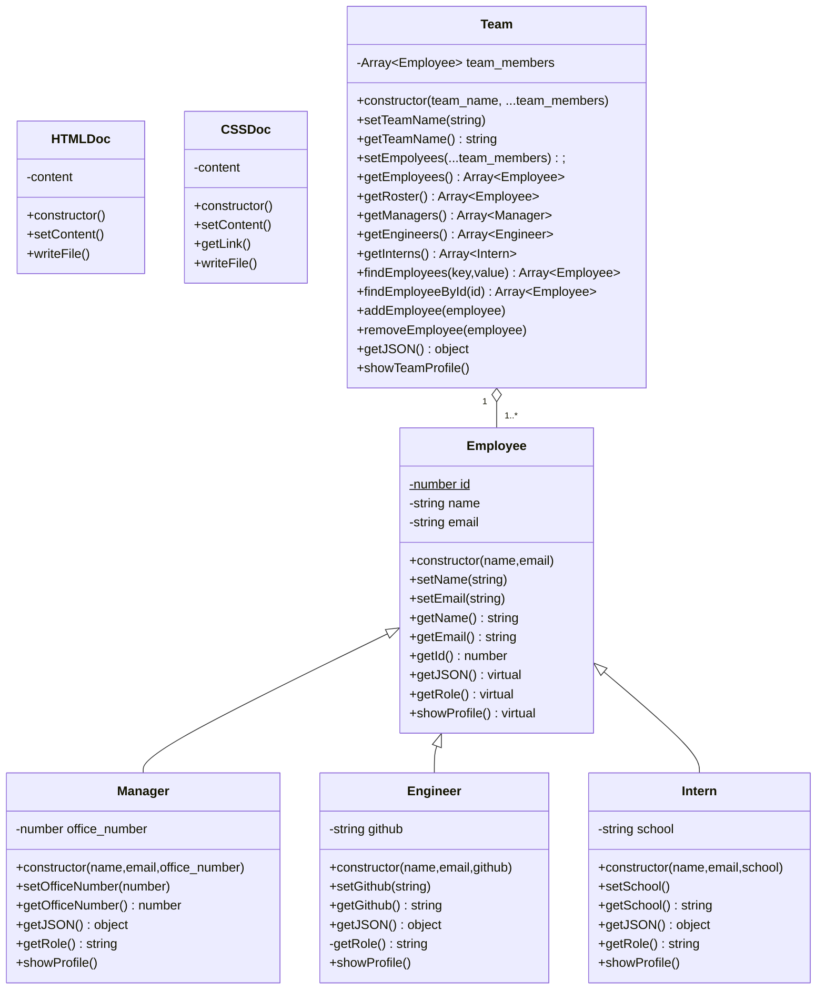
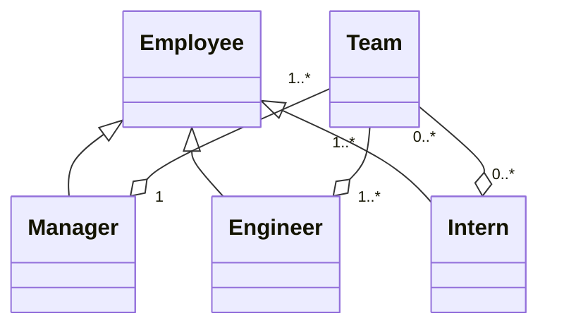

# team-profile-generator

<!-- TODO: Insert video link from YouTube -->
<!-- TODO: Insert Screen shot of the command line -->
<!-- TODO: Insert Screen shot of the output -->

Homework Challenge 10, Due December 20, 2022

## Install

npm install

## Test

Tests are done with Jest.

```bash
npm test
```

## Usage

```bash
node index.js
```

## Assignment
Your challenge is to build a Node.js command-line application that takes in information about employees on a software engineering team and **generates an HTML webpage** that displays summaries for each person.

Because this Challenge will require the use of the `inquirer` package, ensure that you install and use `inquirer` version 8.2.4. To do so, use the following command in your project folder: `npm i inquirer@8.2.4`.

Testing is key to making code maintainable, you’ll also write unit tests for each part of your code and ensure that it passes all of them.

This application won’t be deployed, you’ll also need to provide a link to a walkthrough video that demonstrates its functionality and all of the tests passing. You’ll need to submit a link to the video and add it to the README of your project.

## User Story

```
AS A manager
I WANT to generate a webpage that displays my team's basic info
SO THAT I have quick access to their emails and GitHub profiles
```

## Acceptance Criteria

```
GIVEN a command-line application that accepts user input
WHEN I am prompted for my team members and their information
THEN an HTML file is generated that displays a nicely formatted team roster based on user input
WHEN I click on an email address in the HTML
THEN my default email program opens and populates the TO field of the email with the address
WHEN I click on the GitHub username
THEN that GitHub profile opens in a new tab
WHEN I start the application
THEN I am prompted to enter the team manager’s name, employee ID, email address, and office number
WHEN I enter the team manager’s name, employee ID, email address, and office number
THEN I am presented with a menu with the option to add an engineer or an intern or to finish building my team
WHEN I select the engineer option
THEN I am prompted to enter the engineer’s name, ID, email, and GitHub username, and I am taken back to the menu
WHEN I select the intern option
THEN I am prompted to enter the intern’s name, ID, email, and school, and I am taken back to the menu
WHEN I decide to finish building my team
THEN I exit the application, and the HTML is generated
```

## Class Diagram

> You're gonna love this. This class diagram the mockup is based on was created using [Mermaid](https://mermaid-js.github.io/mermaid/#/classDiagram). Markdown supports it. So does Github. See [UML-Diagrams.org](https://www.uml-diagrams.org/) for a better understanding of how to use UML.

<!-- TODO: id might be static -->



- The `Employee` class *is* the **generalization** (parent class) of `Manager`, `Engineer`, and `Intern` classes.
- A `Team` *has* `Employee`s. Thus the relationship between the team `Team` and `Employee` classes is an **aggregation**.
- I could have said that the `Manager` *is part of* the `Team`, and tha manager could have a list of `Engineer`s and `Intern`s, but now I'm getting too complex.



* A `Team` should have one `Manager`
* A `Team` should have at least one `Engineer`.
* A `Team` can have `Intern`s, but that is optional.

The mockup had a `Team` with five `Employee`s in it. One was a `Manager`, three were `Engineer`s, and one was an `Intern`.

I will assume two things with this mockup and the diagrams:

1. `id` is a **static** variable. Every employee has one. Each `id` is unique. No one `id` is the same.
2. A `showProfile` method will be used. In C++ or Java, this would be set as a *virtual* function. This function will be overridden in the child classes of `Employee` since the output for each type of object will be different.
3. The `getRole` method is also "virtual". Overrides ensue.
4. Another virtual function that I felt like adding is `getJSON()`. It will make fetching the data from an object easier. "MVP" be damned!


## TODO List

> Note: I've probably added more requirements than asked for this project, but its probably better that I did.  It's not a Minimal Viable Product (MVP) if it doesn't DO anything.

- [x] Install inquirer.
- [x] Install Jest for testing. (Note: Use the `--save-dev` attribute when installing it.)
- [ ] Code stuff
  - [ ] `lib` directory should contain the classes
    - [ ] `Employee.js`
    - [ ] `Engineer.js`
    - [ ] `Intern.js`
    - [ ] `Manager.js`
    - [ ] `Team.js` (not required, I just think it is approproate)
    - [ ] `HTMLDoc.js` (Where do you think the HTML is going to come from?!)
    - [ ] `CSSDoc.js`  (Where do you think the CSS is going to come from?!)
  - [ ] `src` can contain template helper code
  - [ ] Create tests in the ~~`__tests__`~~ `tests` directory for Jest for the following classes. (Seriously, why would anyone would anyone put their tests in a directory with leading underscores?! Problems ensue.)
    - [ ] `Employee` (`tests/Employee.test.js`)
    - [ ] `Engineer` (`tests/Engineer.test.js`)
    - [ ] `Intern`   (`tests/Intern.test.js`)
    - [ ] `Manager`  (`tests/Manager.test.js`)
    - [ ] `Team`     (`tests/Team.test.js`)  (not required, I just think it makes sense to create a collection.)
  - [ ] Create a prompt where you have the following options
    - [ ] Ask if you would like to create a team
    - [ ] List teams
    - [ ] Ask if you would like to delete a team
    - [ ] List team members
    - [ ] Show a team member's profile
    - [ ] Ask if you want to add a manager to a team (limit 1)
    - [ ] Ask if you want to add an engineer to a team (at least 1)
    - [ ] Ask if you want to add an intern to a team
    - [ ] Ask if you want to name the team (not required, I just think a team should have a name)
    - [ ] Ask if you would like to remove a team member
    - [ ] Add an option to exit the application
  - [ ] When you add a manager
    - [ ] Enter the manager's name
    - [ ] ~~Enter the manager's employee id~~ (This should be statically assigned)
    - [ ] Enter the office number
    - [ ] Verify the input data
    - [ ] Return to the main menu when complete
  - [ ] When you add a engineer
    - [ ] Enter the engineer's name
    - [ ] ~~Enter the engineer's employee id~~ (This should be statically assigned)
    - [ ] Enter the engineer's github
    - [ ] Verify the input data
    - [ ] Return to the main menu when complete
  - [ ] When you add an intern
    - [ ] Enter the intern's name
    - [ ] ~~Enter the intern's employee id~~ (This should be statically assigned)
    - [ ] Enter the intern's school
    - [ ] Verify the input data
    - [ ] Return to the main menu when complete
  - [ ] Have an option to list the members of the team (Pretty sure there's an `inquirer-table` that can help us out.)
  - [ ] Have an option to list the information of a team member
  - [ ] Have options to edit information
  - [ ] When exiting the application, verify if you want to construct the data
  - [ ] If you just want to leave, don't build the HTML
  - [ ] Otherwise build the HTML
  - [ ] In the HTML, click on a team to show the list of team members
  - [ ] Click on a team member to go to their profile page
  - [ ] Click on a team member's email address to send them an email with their email address in the To field
  - [ ] Build a CSS file for our HTML
- [ ] Submit Assignment
  - [ ] With URL of a Walkthrough Video (will be posted on YouTube)
    - [ ] Walkthrough must show that the test files all pass from the command line (`npm test`)
    - [ ] Walkthrough must show how the application would be invoked from command line (`node index.js`)
    - [ ] Walkthrough must show how a user would enter responses to all the promos in the application.
    - [ ] Walkthrough must demonstrate the HTML file that matches the user input.
  - [ ] With sample HTML generated ~~(will likely be in a directory called `demo` or `example`)~~ in the `dist` directory.
  - [ ] With URL of the repo that has a README.

Note: For Engineers, you don't have to create a link for their github page, but it probably would be cool if you did, even a fake one.

## Personal Notes
- Using Node 16 on this project like the [previous project](https://github.com/jrcharney/pro-readme-generator).  It was working for that too.  I know 18 and 19 are out, but I think 16 will still do this. I'll eventually upgrade to 18 when I do an operating system upgrade over the winter break on my home office computer.
- The latest version of `inquirer` was working fine in the previous project. I honestly don't see the need to choose a specific version for this project too.
- This will likely be the first project where I ever use Jest for testing.
- Also being used to help with coding will be ESLint and Prettier.

## Adding Jest, ESLint and Prettier

May as well.

```
npm install --save-dev jest
npm init @eslint/config
npm install --save-dev --save-exact prettier
echo {}> .prettierrc.json
npm install --save-dev eslint-config-prettier
```

For ESLint set things up to use NPM and hjjave the files saved as a JSON file.  The result should be a `.eslint.json` file.

You can use ESLint directory by typing

```
npx esline file_you_want_to_lint.js
```

Prettier will use this command to format files.

```
npx prettier --write .
```

ESLint Config Prettier turns off all the ESLint rules that are unnecessary or that might conflict with Prettier

In the `.eslintrc.json` file, change the `"extends": "eslint:recommended",` line to this.

```json
    "extends": [
        "eslint:recommended",
        "prettier"
    ],
```

Prettier must be last on that list.

Check out these pages for details

* [ESLint getting started](https://eslint.org/docs/latest/user-guide/getting-started)
* [Prettier Install](https://prettier.io/docs/en/install.html)
* [ESLint config Prettier](https://github.com/prettier/eslint-config-prettier)

Jest doesn't work with ES Modules by default, so a `jest.config.json` file was added, and the `npm test` command was modified to use them.